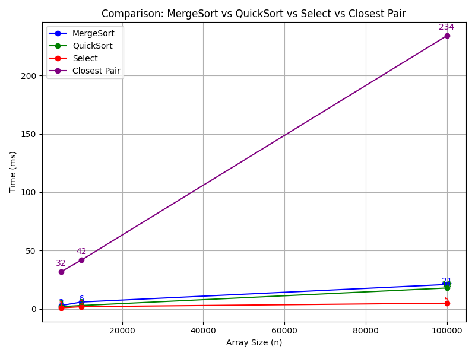

# Algorithms Assignment 1

Implementation and benchmarking of classical algorithms:
- **MergeSort** (Divide & Conquer, Master Case 2, with cut-off optimization).
- **QuickSort** (randomized pivot, smaller-first recursion).
- **Deterministic Select** (Median-of-Medians, O(n)).
- **Closest Pair of Points** (Divide & Conquer in 2D, O(n log n)).

---

## Build & Run

### Build
```bash
mvn clean install
```
## Run
```bash
java -cp target/assignment1-1.0-SNAPSHOT.jar com.zhanibek.algorithms.Main <algorithm> <size>
```
### Examples
``` bash
java -cp target/assignment1-1.0-SNAPSHOT.jar com.zhanibek.algorithms.Main quicksort 10000
java -cp target/assignment1-1.0-SNAPSHOT.jar com.zhanibek.algorithms.Main mergesort 5000
java -cp target/assignment1-1.0-SNAPSHOT.jar com.zhanibek.algorithms.Main closest 100000
```
## CI/CD
The project uses GitHub Actions to run JUnit5 tests automatically on each commit.
## Metrics
### Each run saves results into results.csv with columns:
Algorithm, Size, TimeMs, Comparisons, Swaps, MaxDepth
### Example:
quicksort,10000,3,724,0,0,0

mergesort,10000,3,853,0,0,0

closest,10000,42,111,0,0,0
## Plots
Benchmark results were visualized in Python.



# Analysis & Conclusions

## MergeSort (blue)

* Complexity O(n log n).
* Time grows steadily with n.
* Stable and predictable performance.

## QuickSort (green)
* Also O(n log n) on average, but often faster than MergeSort in practice.
* Uses randomized pivot and smaller-first recursion to avoid deep stacks.

## Deterministic Select (red)
* Much faster than full sorting, since it only finds the k-th element.
* Complexity O(n) confirmed experimentally.

## Closest Pair (purple)
* Although asymptotically O(n log n), practical running time is higher due to geometric operations.
* For large n, performance difference compared to sorting algorithms becomes very visible.

## Final takeaway:
* Select is the fastest (linear time).
* QuickSort & MergeSort are efficient for full sorting.
* Closest Pair is heavier, but necessary for 2D problems.
